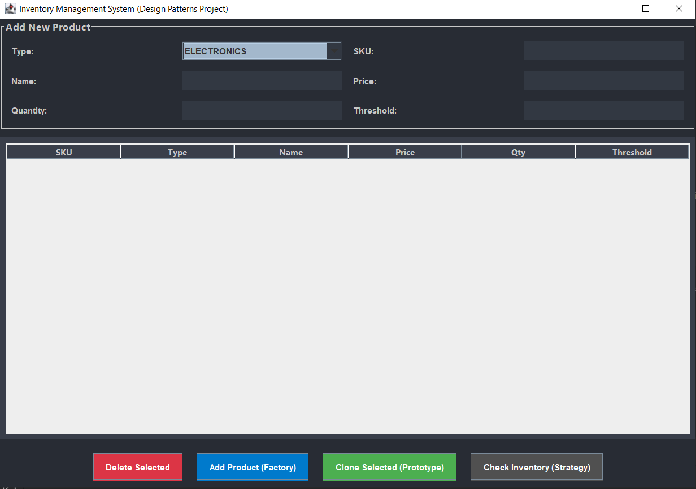

Inventory Management System (Design Patterns Showcase)

A comprehensive Inventory Management Desktop Application built with Java and Swing GUI. This project serves as a practical implementation of various Gof Design Patterns to solve common software architecture challenges.
 Design Patterns Implemented
1. Builder Pattern (My Core Responsibility)

    Location: Product class (Static Inner Builder). 

Purpose: Decouples the construction of a complex Product object from its representation, allowing for step-by-step construction.

Key Feature: Enables a Fluent API to set only required attributes (e.g., Name, Price, SKU) while avoiding "Constructor Overloading" or "Telescoping Constructors."

2. Proxy Pattern

    Location: WarehouseProxy, IWarehouse interface. 

Purpose: Acts as an intermediary to control access to the RealWarehouse object.

Mechanisms: * Lazy Initialization: The real warehouse object is only instantiated when a client requests an operation (e.g., adding a product), saving system resources.

    Access Control: Restricts sensitive operations to authorized users only. 

3. Singleton Pattern

    Location: InventoryManager class. 

Purpose: Ensures that only one instance of the manager exists throughout the application's lifecycle.

Benefit: Provides a global point of access for centralized inventory control and data consistency.

4. Factory Pattern

    Location: ProductFactory class. 

Purpose: Defines an interface for creating objects but allows the factory to decide which class (Electronics, Furniture, etc.) to instantiate based on the category.

Benefit: Promotes the "Open/Closed Principle" by making it easy to add new product types without modifying the GUI logic.

5. Prototype Pattern

    Location: Prototype interface & Product.clone(). 

Purpose: Allows cloning existing product objects to create new ones.

Benefit: Facilitates rapid data entry by copying attributes from a template object and only modifying unique fields like SKU.

 GUI & Core Features
 

    Modern UI: Dark-themed professional interface built with Java Swing. 

CRUD Operations: Full support for Adding, Deleting, and Cloning inventory items.

Inventory Monitoring: Real-time stock level alerts and threshold checking.

Data Persistence: Managed via a centralized repository structure.

 Getting Started

    Prerequisites: Ensure you have JDK 17 or higher installed. 

Clone the Project: ```bash git clone https://www.google.com/search?q=https://github.com/your-username/Inventory-Management-System.git

Open in IDE: Import the project into IntelliJ IDEA or NetBeans.

Run: Execute the InventoryManagementSystem.java file to start the application.
